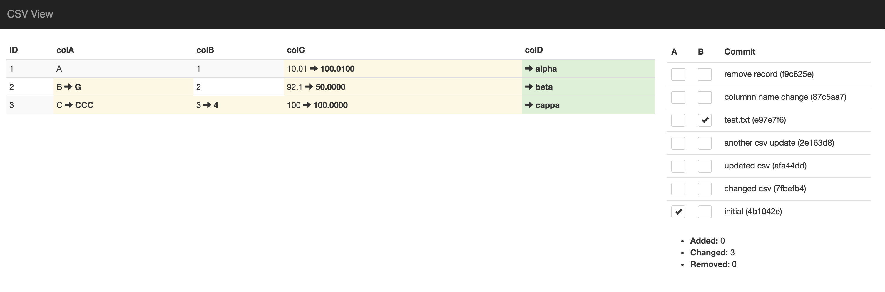
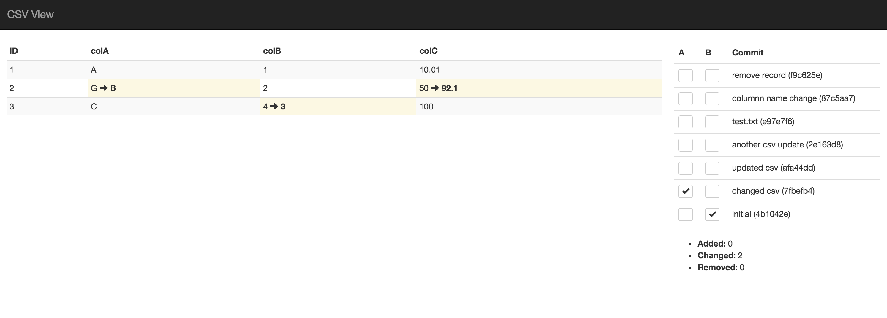

# csv-view

Compare CSV Files in a git repo. `csv-view` is still in development. Pull-requests and suggestions are welcomed.

# Usage

```
python setup.py install
```

Start `csv_view` from the command-line. It should open your browser.

```
csv_view <filename> 
```


# Screen shots


